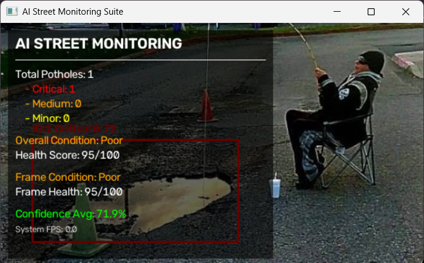

# AI Street Monitoring

AI-powered street monitoring tool that detects potholes in images and video using a YOLO model, classifies them by severity, and reports an overall road health score.

## Features

- Detects potholes in images or video streams
- Classifies each detection as **Critical**, **Medium**, or **Minor**
- Reports total potholes found, per-severity counts, and average confidence
- Displays a road health score and system FPS overlay
## Output



## Requirements

- Python 3.8+
- ultralytics (YOLO)
- opencv-python

Install dependencies:

```bash
pip install ultralytics opencv-python
```

## Usage

Run detection on an image or video:

```bash
python main.py --model my_model.pt --source pothole-img1.webp
```

```bash
python main.py --model my_model.pt --source pothole_video.mp4
```

**Arguments**

| Argument   | Description                          |
|------------|---------------------------------------|
| `--model`  | Path to the trained YOLO weights file (`.pt`) |
| `--source` | Path to input image or video file     |

## Project Structure

```
Pothole_Detection/
├── main.py            # Detection script
├── my_model.pt         # Trained YOLO model weights
├── train_test.ipynb    # Model training / testing notebook
├── pothole-img*.webp/jpg  # Sample test images
├── pothole_video*.mp4     # Sample test videos
└── .gitignore
```

## Notes

- Model weights, sample images, and videos are excluded from version control (see `.gitignore`) — download or generate them separately.
- Training details and experimentation are in `train_test.ipynb`.


